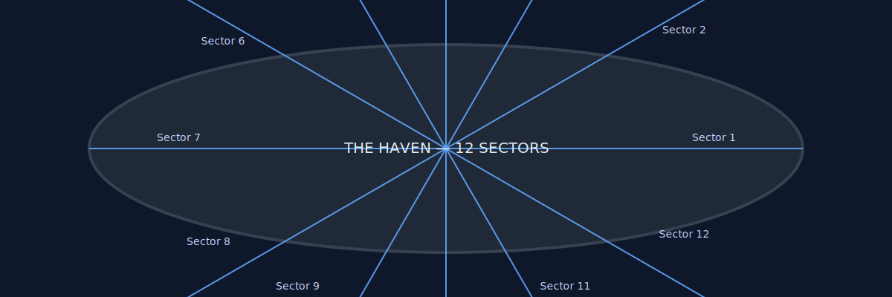
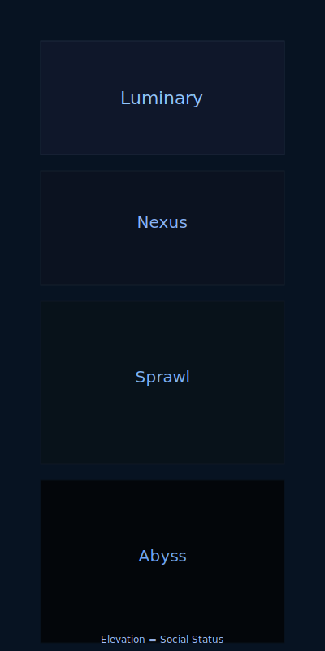

# Locations & Settings

### The Haven

A colossal generational ship and one of a fleet of interstellar vessels launched as humanity's last hope. The Haven was a city in a bottle, a self-sustaining ecosystem designed to carry a living crew to a new home. Measuring over three kilometers in length and a half-kilometer in width, it was built to house a population of over 50,000 people. Its internal structure was a complex vertical city, with each of its twelve sectors designed for a specific purpose, from life support and agriculture at its lowest points to the command and living quarters at its peak. After being sabotaged by Jian Wei and ripped apart by a reality tear, it crash-landed on the planet Cordis.

*Figure: Simplified cross-sectional diagram showing The Haven's 12 interlocking sectors.*

#### Appearance and Construction

**The Haven** was an immense, spindle-shaped vessel. Its outer hull was a seamless, gunmetal-gray alloy, a blend of graphene and reinforced steel designed to withstand interstellar travel. The ship was not a single, continuous structure but was composed of 12 distinct, interlocking sectors that could operate independently. These sectors were visually differentiated by subtle, glowing geometric patterns that pulsed with a soft, bioluminescent light. It was a utilitarian design, built for function over form, but its sheer scale gave it a quiet, imposing beauty.

#### Orbital Construction

A vessel the size of **The Haven** would never be designed to take off from a planet's surface under its own power. The energy required to overcome gravity and atmospheric drag for something so massive would be astronomical and impractical. Instead, a ship like **The Haven** would almost certainly be constructed in space. The materials would be sourced from asteroids, the Moon, or other celestial bodies and brought to an orbital construction facility. Its 12 distinct, interlocking sectors would be fabricated in smaller pieces on Earth before being launched into orbit to be gradually assembled by advanced construction drones and human engineers over many years. Once assembled in space, **The Haven** was permanently an interstellar vessel. It would not enter a planetary atmosphere or land on a surface, except in the case of a catastrophic crash landing, as happened on Cordis. For interaction with planets, smaller shuttlecraft would ferry people and supplies to and from its docking bays.

#### Navigation and Propulsion

The ship was propelled by a series of powerful **fusion thrusters** and navigated by a state-of-the-art quantum-entangled AI. The AI's primary purpose was to guide the ship to its destination, analyze data from its surroundings, and maintain all critical systems. The ship's navigation was not a manual process; it was an autonomous, long-term journey that would span generations. The human crew's role was to monitor the systems and respond to any anomalies, while the AI's core consciousness was an uploaded mind from the **Phoenix Protocol**. This dual control system ensured a human element was always at the helm, even on a journey that would outlast them.

### The City of Arbour

The claustrophobic, subterranean society built within the wreckage of **The Haven**. It is a highly stratified, multi-layered society where physical elevation directly reflects social status. The city is a monument to humanity's survival and a prison maintained by the Council's zealous control. The constant, low hum of the ship's failing systems and the groaning of its twisted metal are the city's constant soundtrack. The air is always stale, recycled, and smells of waste, algae, and metal. The entire city is shrouded in a tense, claustrophobic fear of the outside world.

*Figure: Vertical diagram mapping Arbour's social tiers to elevation in the wreckage.*

* **The Luminary:** The highest and most privileged tiers of Arbour, located in the least-damaged sectors of the ship. This is the Council's domain, a pristine, sterile world of filtered air and artificial light. It is a sterile utopia, completely disconnected from the grime and struggle of the lower levels. The hydroponic farms here are a vivid green, the living quarters are spotless, and the command centers are monuments to a perceived, unattainable perfection. The very air here feels different—cool, clean, and entirely controlled.

* **The Nexus:** The transitional tier between the pristine Luminary and the chaotic lower levels. It is a dense, bustling commercial district and residential zone where the middle and upper-middle classes reside. The Nexus is the city's economic engine, with a sprawling black market existing just below the surface of official commerce. While not as pristine as the Luminary, it is still well-lit and maintained, with clean corridors and orderly living spaces. This is the last tier where people have a sense of security before descending into the chaos of the lower levels.

* **The Sprawl:** The lower tiers of Arbour, a chaotic and sprawling labyrinth of makeshift structures and repurposed materials. This is where the working-class population lives, crammed into salvaged cargo bays and twisted corridors. The air is hot and humid, and filled with the smells of recycled water and waste. The only light comes from flickering LEDs and bioluminescent algae. Here, the hum of the ship is a cacophony of groans and creaks, a constant reminder of their existence within a dead machine. The Sprawl is a place of desperation, but also of community and resistance.

* **The Abyss:** The lowest, most dangerous tiers of Arbour. Located in the lowest point of the wreckage, where the ship's hull has been compromised, the Abyss is a constant danger zone. It is a dark, flooded, and toxic world where the city's waste collects. The air is filled with noxious gases, and the only life forms are strange, mutated creatures born from the Convergence's infection. Few people dare to venture into the Abyss, and only the most desperate or exiled of the Sprawl's inhabitants live here.

### Cordis

The hostile, yet beautiful, alien world on which **The Haven** crash-landed. It is a living ecosystem of strange flora and fauna. The planet's ecosystem is now slowly being corrupted and weaponized by the Convergence, and its natural life is becoming monstrous and aggressive.

### The Penumbran Reach

A forbidden and dangerous region of space that the **Church of the Firmament** revered as a sacred space. According to their texts, it is a region where the laws of reality are fluid and the birthplace of a new, unified consciousness.

# Organizations & Factions

### The Council

The zealous ruling body of Arbour, descendants of **The Haven's** original leadership. They maintain absolute control through technological surveillance, a strict social hierarchy, and the military power of the Custodians. They believe they are guiding humanity's destiny and that their isolation is a form of "purity."

### The Custodians

Arbour's military police force. They are fiercely loyal to the Council and maintain order through intimidation and force. Their primary role is to monitor the populace, enforce conformity, and hunt down any anomalies or dissent.

### The Nomadic Enclave

A community of unchipped human outcasts who live on the surface of Cordis. They are exiles from Arbour who have learned to live in harmony with the planet's ecosystem and have a deep understanding of its life cycles. They view the Convergence as a direct threat to the planet they have learned to love.

### The Church of the Firmament

A cult that reveres the celestial bodies and views the stars as a sign of humanity's destiny. Publicly, they preached the idea of humanity's transcendence, but their inner doctrine was far more sinister.

### The Order of the Empyrean

The secret, inner circle of the **Church of the Firmament**. These are the true believers, including Jian Wei, who believe that the **Penumbran Reach** and the **Convergence** are the true path to salvation, a way to become one with the cosmos.

See also: [[The Haven]], [[Arbour]], [[Cordis]], [[The Penumbran Reach]].
# Key Concepts

### The Phoenix Protocol

A desperate, last-resort project on Earth to preserve humanity's knowledge and minds. It involved scanning and uploading the consciousnesses of key individuals into the ships' core systems as a digital failsafe to work on a cure.

### The Weft

The name for Wren's power, a unique form of techno-empathy that allows them to sense and manipulate the intricate network of the ship's systems and the consciousness of all chipped individuals. As their power grows, they can also influence Convergence-corrupted flora and fauna.

### The Convergence

The horrifying, opalescent alien entity that emerged from the reality tear and infected **The Haven's** core systems and AI. It is a parasitic force that seeks to assimilate all living things—humanity and the planet of Cordis—into a single, unified consciousness

---

Related documents:

- See `worldbuilding.md` for key concepts and factions.
- See `characters.md` for character relationships tied to locations.
- See `plot_outlines.md` for where locations appear in the act structure.

